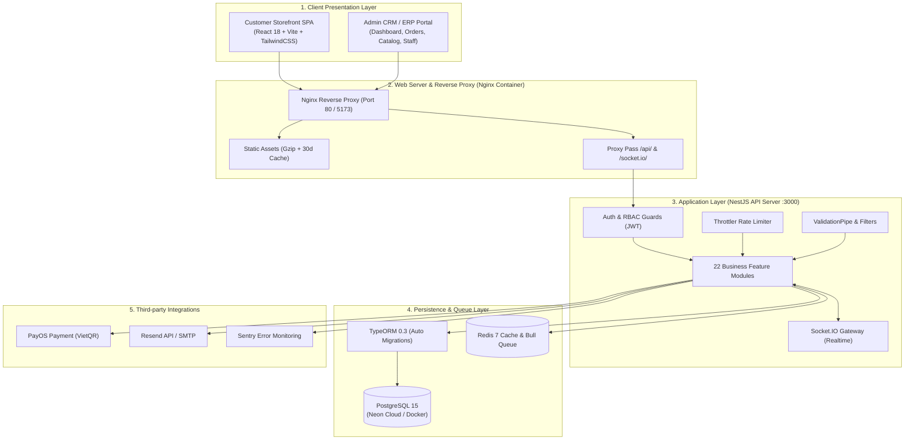
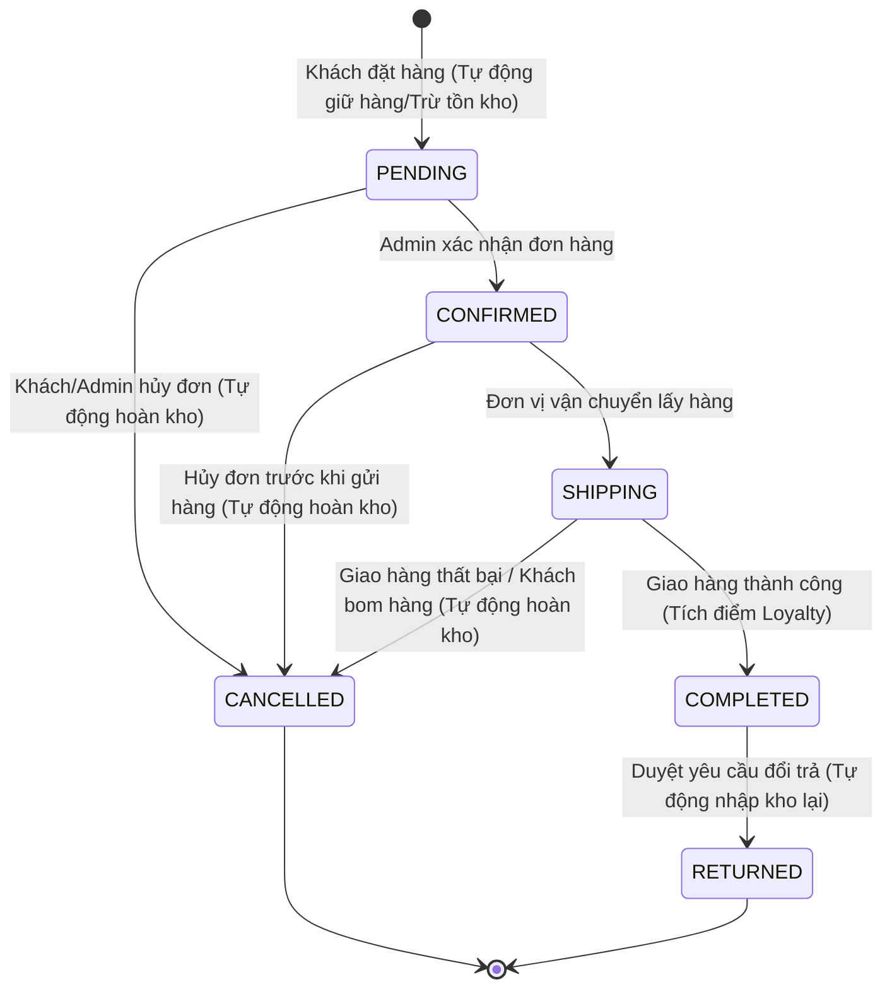

# 🛍️ KTD-STORE — Nền Tảng Thương Mại Điện Tử & Quản Trị MenWear Hub

<p align="center">
  
</p>

<p align="center">
  <strong>Giải pháp thương mại điện tử chuyên nghiệp dành cho thời trang nam cao cấp (Menswear KTDL).</strong><br>
  Tích hợp đồng bộ Cổng bán lẻ trực tuyến (Storefront) và Hệ thống Quản trị Quan hệ Khách hàng & Vận hành Doanh nghiệp (Admin CRM / ERP thu nhỏ).
</p>

<p align="center">
  
  
  
  
  
  
  
  
  
</p>

---

## 📑 Mục Lục
1. [Tổng Quan & Điểm Nhấn Công Nghệ](#1-tổng-quan--điểm-nhấn-công-nghệ)
2. [Kiến Trúc Hệ Thống (Architecture)](#2-kiến-trúc-hệ-thống-architecture)
3. [Cấu Trúc Thư Mục Dự Án](#3-cấu-trúc-thư-mục-dự-án)
4. [Danh Sách Tính Năng Chi Tiết](#4-danh-sách-tính-năng-chi-tiết)
   - [4.1 Phân Hệ Khách Hàng (Customer Storefront)](#41-phân-hệ-khách-hàng-customer-storefront)
   - [4.2 Phân Hệ Quản Trị (Admin CRM & ERP)](#42-phân-hệ-quản-trị-admin-crm--erp)
   - [4.3 Ma Trận Phân Quyền (RBAC) & Giả Lập Vai Trò](#43-ma-trận-phân-quyền-rbac--giả-lập-vai-trò)
5. [Đóng Gói & Triển Khai Docker (Docker Packaging)](#5-đóng-gói--triển-khai-docker-docker-packaging)
6. [Hướng Dẫn Khởi Chạy Nhanh Cho Lập Trình Viên (Local Dev)](#6-hướng-dẫn-khởi-chạy-nhanh-cho-lập-trình-viên-local-dev)
7. [Bảng Cấu Hình Biến Môi Trường (.env Reference)](#7-bảng-cấu-hình-biến-môi-trường-env-reference)
8. [Danh Mục REST API & Realtime Socket.IO](#8-danh-mục-rest-api--realtime-socketio)
9. [Kiểm Thử & Đảm Bảo Chất Lượng (QA & Testing)](#9-kiểm-thử--đảm-bảo-chất-lượng-qa--testing)
10. [Cẩm Nang Khắc Phục Sự Cố (Troubleshooting & FAQs)](#10-cẩm-nang-khắc-phục-sự-cố-troubleshooting--faqs)

---

## 1. 🌟 Tổng Quan & Điểm Nhấn Công Nghệ

**KTD-Store** được phát triển theo định hướng enterprise-grade, tập trung vào hiệu năng vượt trội, kiến trúc module hóa linh hoạt và trải nghiệm người dùng liền mạch:

* ⚡ **Hiệu Năng Vượt Trội & Code-Splitting**: Ứng dụng Vite bundle tối ưu chia nhỏ code theo trang (Rollup Manual Chunks). Các thư viện nặng như `recharts`, `framer-motion`, `lucide-react` chỉ được tải khi người dùng truy cập route tương ứng.
* 📦 **Đóng Gói Docker Chuẩn Production**: Multi-stage build cho cả Backend (`node:20-alpine`) và Frontend (Nginx Alpine reverse proxy), tự động xử lý SPA routing, WebSocket proxy và nén Gzip.
* ☁️ **Linh Hoạt Cơ Sở Dữ Liệu**: Hỗ trợ kết nối song song PostgreSQL cục bộ thông qua Docker hoặc PostgreSQL Serverless trên nền tảng đám mây Neon Tech (hỗ trợ SSL/TLS).
* 💳 **Cổng Thanh Toán PayOS & Sandbox QR Simulator**: Tích hợp quét mã VietQR tự động khớp đơn hàng qua Webhook PayOS, đi kèm cửa sổ mô phỏng thanh toán Sandbox phục vụ kiểm thử và chấm điểm đồ án.
* 🤖 **Trợ Lý Thông Minh AI Stylist**: Chatbot tư vấn phong cách, gợi ý phối đồ, giải đáp chính sách và tính size tự động theo chiều cao/cân nặng.
* 🔔 **Hạ Tầng Thời Gian Thực (WebSockets / Socket.IO)**: Cập nhật biến động kho hàng, tiến độ giao hàng và thông báo quản trị tức thì không cần tải lại trang.
* 🛡️ **Bảo Mật Đa Tầng & Audit Logging**: Phân quyền RBAC nghiêm ngặt (4 vai trò), bảo vệ API bằng Helmet, Throttler rate-limit (120 req/phút), lưu vết Audit Log mọi thao tác nhạy cảm (thay đổi giá, duyệt đổi trả, phân quyền).

---

## 2. 🏛️ Kiến Trúc Hệ Thống (Architecture)

### 2.1 Sơ Đồ Kiến Trúc Phân Tầng



### 2.2 Sơ Đồ Máy Trạng Thái Đơn Hàng (Order State Machine FSM)

Quy trình vòng đời đơn hàng được thực thi nghiêm ngặt, đảm bảo tính toàn vẹn tồn kho và chống gian lận:



---

## 3. 📂 Cấu Trúc Thư Mục Dự Án

Dự án được cấu trúc theo mô hình Monorepo tinh gọn:

```
KTD-Store/
├── .dockerignore                   # Quy tắc loại trừ khi build Docker root
├── .env.docker.example             # File mẫu biến môi trường cho Docker Compose
├── docker-compose.yml              # Điều phối 4 container (PostgreSQL, Redis, Backend, Frontend)
├── package.json                    # Root script điều phối đồng thời Backend + Frontend + Docker
├── README.md                       # Tài liệu tổng quan dự án (File này)
├── SETUP_GUIDE.md                  # Cẩm nang cài đặt chi tiết từng bước
│
├── docs/                           # Tài liệu kỹ thuật dự án
│   ├── architecture/               # Kiến trúc hệ thống & UI/UX spec
│   ├── planning/                   # Đặc tả yêu cầu PRD, Roadmap
│   ├── guides/                     # Hướng dẫn bàn giao & triển khai
│   └── reports/                    # Báo cáo kiểm thử chất lượng
│
├── backend/                        # NestJS API Server (Port 3000)
│   ├── Dockerfile                  # Multi-stage Dockerfile cho NestJS
│   ├── .dockerignore               # Loại trừ node_modules, dist cho Docker build
│   ├── .env.example                # File mẫu biến môi trường Backend
│   ├── nest-cli.json               # Cấu hình Nest CLI
│   ├── tsconfig.json               # TypeScript Compiler Configuration
│   ├── src/
│   │   ├── common/                 # Guards, Decorators, Enums, Filters, Interceptors
│   │   ├── migrations/             # TypeORM Database Migrations (Tự động chạy lúc start)
│   │   ├── modules/                # 22 Phân hệ nghiệp vụ độc lập:
│   │   │   ├── addresses/          # Sổ địa chỉ khách hàng
│   │   │   ├── ai-assistant/       # Trợ lý AI tư vấn sản phẩm
│   │   │   ├── audit-logs/         # Nhật ký kiểm toán bảo mật
│   │   │   ├── auth/               # Xác thực JWT (Storefront & Admin namespaces)
│   │   │   ├── brands/             # Quản lý thương hiệu
│   │   │   ├── cart/               # Giỏ hàng thời gian thực
│   │   │   ├── categories/         # Danh mục sản phẩm (tự động tạo SEO slug)
│   │   │   ├── discounts/          # Mã giảm giá (Voucher engine)
│   │   │   ├── email/              # Dịch vụ gửi mail (Resend / SMTP Gmail)
│   │   │   ├── health/             # Endpoint kiểm tra sức khỏe hệ thống (/api/health)
│   │   │   ├── loyalty/            # Chương trình tích điểm khách hàng thân thiết
│   │   │   ├── notifications/      # Hệ thống thông báo WebSockets
│   │   │   ├── orders/             # Xử lý đơn hàng & State Machine FSM
│   │   │   ├── payments/           # Tích hợp PayOS VietQR & Webhook
│   │   │   ├── permissions/        # Quản lý quyền hạn RBAC
│   │   │   ├── products/           # Sản phẩm, Biến thể (Variants), Màu sắc, Kích cỡ
│   │   │   ├── reports/            # Thống kê doanh thu, báo cáo tài chính
│   │   │   ├── returns/            # Xử lý yêu cầu đổi trả & hoàn kho
│   │   │   ├── reviews/            # Đánh giá & xếp hạng sản phẩm
│   │   │   ├── system-configs/     # Cấu hình tham số hệ thống
│   │   │   ├── users/              # Quản lý tài khoản & phân vai trò
│   │   │   └── wishlists/          # Danh sách sản phẩm yêu thích
│   │   ├── app.module.ts           # Root Module liên kết toàn bộ phân hệ
│   │   ├── main.ts                 # Bootstrap server, Helmet, CORS, GlobalPipes
│   │   └── typeorm.config.ts       # Cấu hình TypeORM CLI
│   └── package.json
│
├── frontend/                       # React SPA Client (Port 5173 / Nginx Port 80)
│   ├── Dockerfile                  # Multi-stage Dockerfile (Node Build -> Nginx Serve)
│   ├── nginx.conf                  # Nginx Reverse Proxy, Gzip, Security Headers, SPA Routing
│   ├── .dockerignore               # Loại trừ node_modules, dist cho Docker build
│   ├── index.html                  # HTML template gốc
│   ├── vite.config.ts              # Cấu hình Vite, Proxy API, Rollup Manual Chunks
│   ├── tailwind.config.js          # Hệ thống Design Tokens & Theme Tailwind
│   ├── src/
│   │   ├── components/             # Reusable UI Components
│   │   │   ├── common/             # Accordion, EmptyState, PromoBadge, QtyStepper, ScrollToTop
│   │   │   ├── layouts/            # AdminLayout, CustomerLayout, SiteHeader, SiteFooter
│   │   │   ├── storefront/         # ProductCard, VariantSelector, FilterSidebar, SandboxModal
│   │   │   ├── admin/              # OrderStatusBadge, StatCard, Charts
│   │   │   ├── widgets/            # AIChatWidget, FloatingContact, NotificationBell
│   │   │   └── guards/             # PermissionGuard bảo vệ route CRM
│   │   ├── context/                # ToastContext, LanguageContext
│   │   ├── hooks/                  # React Query Hooks (useAuth, useCart, useOrders, useProducts)
│   │   ├── lib/                    # apiClient, adminApiClient, authStorage, socketClient
│   │   ├── pages/
│   │   │   ├── storefront/         # 11 màn hình Storefront (Home, Catalog, Detail, Cart, Checkout...)
│   │   │   └── admin/              # 9 màn hình Quản trị CRM (Dashboard, Catalog, Orders, Staff...)
│   │   ├── types/                  # TypeScript Data Contracts
│   │   ├── App.tsx                 # Khai báo React Router & Code Splitting (React.lazy)
│   │   └── main.tsx                # Bootstrap React app
│   └── package.json
│
└── e2e/                            # Playwright End-to-End Test Suites
```

---

## 4. 🎯 Danh Sách Tính Năng Chi Tiết

### 4.1 Phân Hệ Khách Hàng (Customer Storefront)
* 👔 **Danh Mục & Bộ Lọc Đa Chiều**: Lọc đồng thời theo Danh mục, Thương hiệu, Khoảng giá (Price Slider), Màu sắc thực tế, Kích thước (S, M, L, XL, XXL).
* 🔍 **Tìm Kiếm Thông Minh (Smart Search)**: Tìm kiếm tức thời (Debounced Search) hỗ trợ tự động gợi ý từ khóa, thương hiệu và sản phẩm phù hợp.
* 🎨 **Ma Trận Biến Thể Động (Variant Matrix)**: Chọn Size và Màu sắc trực quan, tự động cập nhật số lượng tồn kho thực tế, tự động khóa nút chọn khi hết hàng (out-of-stock).
* 📐 **Bảng Hướng Dẫn Size Chuẩn Xác (Size Guide)**: Nhập Chiều cao (cm) và Cân nặng (kg), thuật toán tự động tính chỉ số và đề xuất kích cỡ tối ưu nhất.
* 🛒 **Giỏ Hàng Tối Ưu (Optimistic Cart)**: Thêm/sửa/xóa sản phẩm nhanh chóng, kiểm tra tồn kho trước khi đặt hàng, áp dụng mã voucher trực tiếp ngay trong giỏ.
* 💳 **Cổng Thanh Toán Toàn Diện (Checkout)**:
  * Thanh toán khi nhận hàng (**COD**).
  * Chuyển khoản ngân hàng tự động qua mã **VietQR (PayOS)** với cửa sổ mô phỏng Sandbox tức thì.
* 📦 **Theo Dõi Đơn Hàng Trực Quan (Order Timeline)**: Xem trạng thái và lịch sử thay đổi của đơn hàng từ khi tạo, duyệt, giao hàng cho đến khi hoàn tất.
* 🔄 **Tạo Yêu Cầu Đổi Trả (Returns Management)**: Khách hàng dễ dàng gửi yêu cầu đổi size hoặc hoàn hàng kèm lý do chi tiết và hình ảnh minh chứng.
* 💖 **Danh Sách Yêu Thích & Sổ Địa Chỉ**: Quản lý nhiều địa chỉ nhận hàng tiện lợi (tích hợp chuẩn dữ liệu hành chính 63 tỉnh thành Việt Nam), lưu trữ các sản phẩm quan tâm.
* 🤖 **Trợ Lý AI Stylist**: Hộp chat AI đồng hành 24/7, tư vấn phối đồ theo phong cách nam tính hiện đại và giải đáp chính sách bán hàng.

---

### 4.2 Phân Hệ Quản Trị (Admin CRM & ERP)
* 📊 **Dashboard & Báo Cáo Doanh Thu (Financial Analytics)**:
  * Thống kê Tổng doanh thu, Số lượng đơn hàng, Đơn chờ xử lý, Tỷ lệ hoàn trả.
  * Biểu đồ doanh thu trực quan theo thời gian thực (thư viện Recharts).
  * Bảng xếp hạng Top 5 sản phẩm bán chạy nhất toàn sàn.
* 📦 **Quản Lý Đơn Hàng & Vòng Đời Trạng Thái (FSM Order Processing)**:
  * Chuyển trạng thái đơn tuần tự: `PENDING` ➔ `CONFIRMED` ➔ `SHIPPING` ➔ `COMPLETED` (hoặc `CANCELLED`).
  * Cơ chế tự động hoàn lại số lượng tồn kho cho các sản phẩm trong đơn khi đơn bị hủy.
* 🏷️ **Quản Lý Danh Mục, Thương Hiệu & Kho Sản Phẩm (Catalog & Inventory)**:
  * Thêm/sửa/xóa sản phẩm, quản lý bộ sưu tập ảnh, SKU tự sinh theo màu và size.
  * Tự động cảnh báo mức tồn kho an toàn (`Low Stock Alert`).
  * Quản lý Màu sắc và Danh mục chuẩn SEO slug tiếng Việt.
* 🎟️ **Quản Lý Khuyến Mãi (Discounts & Vouchers Engine)**:
  * Tạo mã giảm giá theo tỷ lệ `%` hoặc số tiền cố định (VNĐ).
  * Giới hạn ngân sách, số lượt sử dụng tối đa, phạm vi áp dụng (toàn sàn hoặc danh mục cụ thể).
* 🔄 **Xử Lý Đổi Trả & Hoàn Tiền (Returns & Refunds)**:
  * Duyệt/từ chối yêu cầu đổi trả (`APPROVED`, `REJECTED`, `REFUNDED`).
  * Tự động kích hoạt cơ chế nhập kho lại đối với các đơn đổi trả được chấp thuận.
* 👥 **Quản Lý Nhân Sự & Phân Quyền (Staff Management)**:
  * Tạo mới tài khoản nhân viên, phân bổ vai trò (`CEO`, `MANAGER`, `STAFF`).
  * Khóa/mở khóa tài khoản nhân sự tức thì.
* 🛡️ **Nhật Ký Hệ Thống An Ninh (Audit Logs)**:
  * Ghi lại chi tiết IP Client, User ID, loại hành động (`CREATE_PRODUCT`, `UPDATE_ROLE`, `APPROVE_RETURN`), thời gian thực hiện nhằm phục vụ thanh tra hệ thống.

---

### 4.3 Ma Trận Phân Quyền (RBAC) & Giả Lập Vai Trò

Hệ thống được thiết kế với 4 cấp độ quyền hạn phân tầng rõ rệt:

| Quyền hạn / Nghiệp vụ | Super Admin | CEO | Manager | Staff |
|:---|:---:|:---:|:---:|:---:|
| **Xem Dashboard Doanh Thu** | ✅ | ✅ | ✅ | ❌ |
| **Xử Lý & Cập Nhật Đơn Hàng** | ✅ | ✅ | ✅ | ✅ |
| **Quản Lý Sản Phẩm & Tồn Kho** | ✅ | ✅ | ✅ | ❌ |
| **Cấu Hình Khuyến Mãi & Voucher** | ✅ | ✅ | ✅ | ❌ |
| **Xét Duyệt Đổi Trả / Hoàn Tiền** | ✅ | ✅ | ✅ | ✅ |
| **Quản Lý Nhân Viên & Phân Quyền** | ✅ | ✅ | ❌ | ❌ |
| **Xem Nhật Ký Kiểm Toán (Audit Logs)** | ✅ | ❌ | ❌ | ❌ |

> 💡 **Tính Năng Giả Lập Vai Trò (Role Simulation)**: Quản trị viên cấp cao (Super Admin) có thể trải nghiệm giao diện và quyền hạn của bất kỳ vị trí nào (`CEO`, `MANAGER`, `STAFF`) chỉ với 1 click tại thanh Header mà không cần đăng xuất, giúp kiểm thử tính đúng đắn của phân quyền trực quan.

---

## 5. 🐳 Đóng Gói & Triển Khai Docker (Docker Packaging)

KTD-Store được đóng gói hoàn chỉnh bằng Docker và Docker Compose, sẵn sàng triển khai trên bất kỳ máy chủ nào chỉ với một câu lệnh duy nhất.

### 5.1 Kiến Trúc Docker Services

Hệ thống điều phối 4 container liên kết qua mạng nội bộ `menwear_net`:

1. **`menwear_postgres`** (`postgres:15-alpine`): Lưu trữ dữ liệu quan hệ, mount volume `postgres_data`, tích hợp healthcheck `pg_isready`.
2. **`menwear_redis`** (`redis:7-alpine`): Caching và hàng đợi Bull Queue, mount volume `redis_data`, tích hợp healthcheck `redis-cli ping`.
3. **`menwear_backend`** (NestJS 10 Multi-Stage): Container API xây dựng từ `backend/Dockerfile`, chạy dưới quyền user an toàn `node`, tự động thực thi migrations khi khởi động, tích hợp healthcheck `/api/health`.
4. **`menwear_frontend`** (Nginx + React SPA): Container web xây dựng từ `frontend/Dockerfile`, Nginx Alpine phục vụ static files và đóng vai trò Reverse Proxy chuyển tiếp `/api/` và `/socket.io/` vào backend.

---

### 5.2 Khởi Chạy 1-Click Bằng Docker

#### Bước 1: Chuẩn bị file cấu hình môi trường
Tại thư mục gốc dự án, sao chép file cấu hình Docker:
```bash
cp .env.docker.example .env.docker
```
*(Nếu sử dụng Windows PowerShell: `Copy-Item .env.docker.example .env.docker`)*

#### Bước 2: Build và khởi chạy toàn bộ hệ thống
```bash
# Sử dụng script npm đã tích hợp sẵn:
npm run docker:up

# Hoặc sử dụng trực tiếp lệnh docker compose:
docker compose up -d --build
```

#### Bước 3: Truy cập hệ thống
Sau khi các container đạt trạng thái `healthy`, bạn có thể truy cập ngay:
* 🛍️ **Cửa Hàng Storefront**: [http://localhost](http://localhost) (hoặc [http://localhost:5173](http://localhost:5173))
* 🔐 **Cổng Quản Trị CRM**: [http://localhost/admin/login](http://localhost/admin/login)
* 🔌 **Backend REST API**: [http://localhost:3000/api](http://localhost:3000/api)
* 🩺 **Kiểm Tra Sức Khỏe (Healthcheck)**: [http://localhost:3000/api/health](http://localhost:3000/api/health)

---

### 5.3 Các Lệnh Quản Lý Docker Thường Dùng

Dự án đã cấu hình sẵn các phím tắt tiện lợi trong `package.json`:

| Thao tác | Lệnh NPM viết tắt | Lệnh Docker Compose gốc |
|---|---|---|
| **Khởi chạy & Build nền** | `npm run docker:up` | `docker compose up -d --build` |
| **Xem logs thời gian thực** | `npm run docker:logs` | `docker compose logs -f` |
| **Kiểm tra trạng thái container**| `npm run docker:status` | `docker compose ps` |
| **Khởi động lại các container** | `npm run docker:restart`| `docker compose restart` |
| **Dừng & Gỡ bỏ toàn bộ container**| `npm run docker:down` | `docker compose down` |
| **Dừng & Xóa sạch cả Volume data**| `npm run docker:down -- -v`| `docker compose down -v` |

---

## 6. 🚀 Hướng Dẫn Khởi Chạy Nhanh Cho Lập Trình Viên (Local Dev)

Nếu bạn muốn lập trình và sửa đổi trực tiếp mã nguồn trên máy tính:

### 6.1 Yêu Cầu Hệ Thống
* **Node.js**: Phiên bản `18.x` hoặc `20.x` LTS trở lên
* **npm**: Phiên bản `9.x` trở lên
* **Kết nối Internet**: Để kết nối tới Neon Cloud PostgreSQL (không cần cài PostgreSQL local)

---

### 6.2 Khởi Chạy Đồng Thời 1 Lệnh (Recommended)

Tại thư mục gốc dự án (`KTD-Store`):
```bash
# 1. Cài đặt toàn bộ dependencies cho cả 2 phân hệ
npm install
npm --prefix backend install
npm --prefix frontend install

# 2. Khởi chạy song song Backend (Port 3000) và Frontend (Port 5173)
npm run dev
```

---

### 6.3 Khởi Chạy Từng Phân Hệ Riêng Biệt

#### Terminal 1 — Khởi động Backend API (Port 3000):
```bash
cd backend
npm run start:dev
```

#### Terminal 2 — Khởi động Frontend Client (Port 5173):
```bash
cd frontend
npm run dev
```

---

## 7. ⚙️ Bảng Cấu Hình Biến Môi Trường (.env Reference)

Tệp cấu hình biến môi trường của Backend đặt tại `backend/.env` (tham khảo `backend/.env.example` và `.env.docker.example`):

| Tên Biến | Ý Nghĩa / Mục Đích | Giá Trị Mặc Định / Mẫu | Bắt Buộc |
|---|---|---|:---:|
| `PORT` | Cổng lắng nghe của NestJS API Server | `3000` | Không |
| `NODE_ENV` | Chế độ môi trường (`development` / `production`) | `development` | Không |
| `DB_HOST` | Địa chỉ máy chủ PostgreSQL (Neon host hoặc `postgres`) | `ep-dry-pond-xxx.aws.neon.tech` | **Có** |
| `DB_PORT` | Cổng kết nối cơ sở dữ liệu PostgreSQL | `5432` | **Có** |
| `DB_USERNAME` | Tên người dùng cơ sở dữ liệu | `ktd_admin` | **Có** |
| `DB_PASSWORD` | Mật khẩu truy cập cơ sở dữ liệu | `your_secure_password` | **Có** |
| `DB_NAME` | Tên cơ sở dữ liệu | `menwear_db` | **Có** |
| `DB_SSL` | Bật mã hóa SSL/TLS (Bắt buộc là `true` với Neon) | `true` (local: `false`) | **Có** |
| `REDIS_HOST` | Địa chỉ máy chủ Redis Cache | `localhost` (docker: `redis`) | **Có** |
| `REDIS_PORT` | Cổng kết nối Redis Cache | `6379` | **Có** |
| `JWT_SECRET` | Khóa bí mật mã hóa Access Token (Tối thiểu 32 ký tự) | `ktd-store-super-secret-jwt-key-32chars` | **Có** |
| `JWT_EXPIRATION` | Thời hạn hiệu lực của Access Token | `8h` | Không |
| `JWT_REFRESH_SECRET`| Khóa bí mật mã hóa Refresh Token | `ktd-store-super-refresh-jwt-key-32chars` | **Có** |
| `JWT_REFRESH_EXPIRATION`| Thời hạn hiệu lực của Refresh Token | `7d` | Không |
| `FRONTEND_URL` | Danh sách URL Client cho phép CORS (phân tách dấu phẩy) | `http://localhost:5173,http://localhost` | **Có** |
| `PAYOS_CLIENT_ID` | Client ID từ cổng thanh toán PayOS | `your-payos-client-id` | Tùy chọn |
| `PAYOS_API_KEY` | API Key từ cổng thanh toán PayOS | `your-payos-api-key` | Tùy chọn |
| `PAYOS_CHECKSUM_KEY`| Checksum Key xác thực Webhook PayOS | `your-payos-checksum-key` | Tùy chọn |
| `EMAIL_PROVIDER` | Bộ phát email (`resend` hoặc `smtp`) | `resend` | Không |
| `RESEND_API_KEY` | Khóa API gửi email từ Resend.com | `re_xxx` | Tùy chọn |
| `SMTP_HOST` | Địa chỉ máy chủ SMTP (Gmail, SendGrid) | `smtp.gmail.com` | Tùy chọn |
| `SMTP_PORT` | Cổng SMTP SSL/TLS | `465` | Tùy chọn |
| `SMTP_USER` | Tài khoản email gửi thông báo | `your-email@gmail.com` | Tùy chọn |
| `SMTP_PASS` | Mật khẩu ứng dụng (App Password 16 ký tự) | `xxxx xxxx xxxx xxxx` | Tùy chọn |
| `SENTRY_DSN` | URL theo dõi lỗi thời gian thực từ Sentry.io | `https://xxx@sentry.io/xxx` | Tùy chọn |

---

## 8. 📡 Danh Mục REST API & Realtime Socket.IO

Tất cả các REST API đều có tiền tố chung `/api`.

### 🔑 1. Authentication & Quản Lý Người Dùng
* `POST /api/auth/register` — Đăng ký tài khoản khách hàng mới.
* `POST /api/auth/login` — Đăng nhập hệ thống (Storefront / CRM), cấp phát cặp Access/Refresh Token.
* `POST /api/auth/refresh` — Làm mới Access Token khi hết hạn.
* `GET /api/users` — Lấy danh sách tài khoản người dùng (Admin).
* `POST /api/users` — Tạo mới tài khoản nhân sự và phân vai trò (`CEO`, `MANAGER`, `STAFF`).
* `PATCH /api/users/:id` — Cập nhật thông tin tài khoản / Phân quyền / Khóa tài khoản.

### 🛍️ 2. Quản Lý Sản Phẩm, Danh Mục & Thương Hiệu
* `GET /api/products` — Lấy danh sách sản phẩm (hỗ trợ phân trang, tìm kiếm, lọc theo giá, màu, size, danh mục, sắp xếp).
* `GET /api/products/:id` — Chi tiết sản phẩm kèm danh sách biến thể (Variants), bảng màu, kích cỡ và đánh giá.
* `POST /api/products` — Tạo sản phẩm mới kèm bộ biến thể (Admin).
* `PATCH /api/products/:id` — Cập nhật thông tin sản phẩm và điều chỉnh tồn kho biến thể.
* `DELETE /api/products/:id` — Xóa sản phẩm khỏi hệ thống.
* `GET /api/categories` — Lấy danh sách cây danh mục sản phẩm.
* `POST /api/categories` — Tạo danh mục mới (tự động tạo SEO slug tiếng Việt chuẩn).
* `GET /api/brands` — Lấy danh sách các thương hiệu thời trang.

### 🛒 3. Giỏ Hàng & Sổ Địa Chỉ
* `GET /api/cart` — Lấy dữ liệu giỏ hàng của tài khoản hiện tại.
* `POST /api/cart/items` — Thêm sản phẩm & biến thể tương ứng vào giỏ hàng.
* `PATCH /api/cart/items/:id` — Điều chỉnh số lượng sản phẩm trong giỏ.
* `DELETE /api/cart/items/:id` — Xóa sản phẩm khỏi giỏ hàng.
* `GET /api/addresses` — Lấy danh sách sổ địa chỉ nhận hàng của khách.
* `POST /api/addresses` — Thêm mới địa chỉ nhận hàng.

### 📦 4. Đơn Hàng & Thanh Toán
* `POST /api/orders` — Đặt hàng mới (hỗ trợ thanh toán COD và VietQR PayOS).
* `GET /api/orders/my-orders` — Lấy lịch sử mua hàng của cá nhân khách hàng.
* `GET /api/orders` — Danh sách toàn bộ đơn hàng trong hệ thống (Admin).
* `PATCH /api/orders/:id/status` — Cập nhật trạng thái đơn hàng theo FSM (Xác nhận, Giao hàng, Hoàn tất, Hủy).
* `POST /api/payments/create-payment-link` — Tạo mã thanh toán QR qua PayOS.
* `POST /api/payments/webhook` — Endpoint tiếp nhận thông báo kết quả chuyển khoản từ PayOS.

### 🎟️ 5. Khuyến Mãi, Đổi Trả, Đánh Giá & AI
* `POST /api/discounts/validate` — Kiểm tra tính hợp lệ và tính số tiền giảm giá của voucher.
* `POST /api/returns` — Khách hàng gửi yêu cầu đổi size / trả hàng.
* `PATCH /api/returns/:id/status` — Quản trị viên duyệt hoặc từ chối yêu cầu đổi trả (tự động nhập kho lại).
* `POST /api/reviews` — Gửi đánh giá và xếp hạng sao cho sản phẩm đã mua.
* `POST /api/ai-assistant/chat` — Gửi câu hỏi tư vấn trang phục tới Trợ lý AI.
* `GET /api/reports/dashboard` — Lấy số liệu thống kê tổng hợp doanh thu và đơn hàng cho Admin Dashboard.
* `GET /api/health` — Kiểm tra trạng thái hoạt động của Server, Database và Redis Cache.

### 🔔 6. WebSockets Gateway (Socket.IO)
* **Namespace**: `/` (Port 3000 / Proxy qua Nginx `/socket.io/`)
* **Sự kiện Lắng Nghe (Server Emits)**:
  * `order_status_updated`: Bắn tín hiệu khi trạng thái đơn hàng thay đổi.
  * `notification`: Thông báo mới gửi tới khách hàng hoặc nhân viên quản trị.
  * `inventory_alert`: Cảnh báo kho hàng khi có mặt hàng chạm ngưỡng tồn kho tối thiểu.

---

## 9. 🧪 Kiểm Thử & Đảm Bảo Chất Lượng (QA & Testing)

Dự án duy trì bộ kiểm thử tự động toàn diện với độ bao phủ cao (146 bài kiểm thử passed 100%):

### 1. Unit Tests Backend (NestJS + Jest)
Kiểm thử toàn bộ các Services nghiệp vụ, Guards phân quyền, DTO Validation và xử lý Transaction:
```bash
npm run test:backend
# hoặc
npm --prefix backend test
```
> ✅ **Kết quả**: **18/18 Test Suites passed**, **102/102 Tests passed** (Bao gồm Auth, Orders, Products, Discounts, Returns, Loyalty, Health, Permissions Guard,...).

---

### 2. Unit Tests Frontend (React 18 + Vitest)
Kiểm thử render giao diện, luồng giỏ hàng, bộ chọn biến thể, chuyển trạng thái đơn hàng và phân quyền:
```bash
npm run test:frontend
# hoặc
npm --prefix frontend test -- --run
```
> ✅ **Kết quả**: **13/13 Test Files passed**, **44/44 Tests passed** (Bao gồm Cart Page, Admin Orders Flow, Variant Selector, Redesign Flows, Confirm Modals,...).

---

### 3. Kiểm Tra Đóng Gói Bundle Sản Phẩm (Production Bundle Verification)
```bash
npm run build
```
> ✅ **Kết quả**: Cả Backend NestJS và Frontend React Vite biên dịch thành công 100%, tự động tree-shaking và chia tách chunks tối ưu, sẵn sàng đóng gói vào Docker image.

---

## 10. 🛠️ Cẩm Nang Khắc Phục Sự Cố (Troubleshooting & FAQs)

### Q1: Bị lỗi xung đột cổng (Port already in use 3000, 5173 hoặc 80)?
* **Khắc phục**: Kiểm tra các tiến trình đang chiếm giữ cổng và tắt chúng:
  ```powershell
  # Windows PowerShell:
  Get-Process -Id (Get-NetTCPConnection -LocalPort 3000).OwningProcess | Stop-Process -Force
  ```
  Hoặc có thể thay đổi biến `PORT=3001` trong `backend/.env`.

---

### Q2: Không kết nối được Database Neon Cloud (Lỗi SSL / Connection Timeout)?
* **Khắc phục**: 
  1. Đảm bảo bạn đã đặt `DB_SSL=true` trong file `backend/.env`.
  2. Kiểm tra chuỗi kết nối host có kết thúc bằng `.neon.tech`.
  3. Nếu đường truyền mạng chặn cổng 5432, hãy thử sử dụng tính năng pooled connection string do Neon cung cấp.

---

### Q3: Docker Desktop báo lỗi `failed to connect to the docker API`?
* **Khắc phục**: Đảm bảo ứng dụng **Docker Desktop** đã được mở và khởi động hoàn tất (biểu tượng cá voi màu xanh lá cây ở khay hệ thống) trước khi chạy lệnh `npm run docker:up`.

---

### Q4: Nginx trên Docker báo lỗi không tìm thấy trang khi F5 (Reload Page)?
* **Khắc phục**: Cấu hình Nginx trong `frontend/nginx.conf` đã được thiết lập chỉ thị `try_files $uri $uri/ /index.html;` nhằm hỗ trợ React Router HTML5 History Mode. Khi build lại container, hãy sử dụng cờ `--no-cache` để cập nhật cấu hình mới:
  ```bash
  docker compose build --no-cache frontend
  docker compose up -d frontend
  ```

---

## 📄 Bản Quyền & Giấy Phép

Dự án được xây dựng và phát triển bởi đội ngũ **KTD-Store (MenWear Hub)**.  
Phát hành theo giấy phép [MIT License](LICENSE). Mọi quyền được bảo lưu © 2026.
