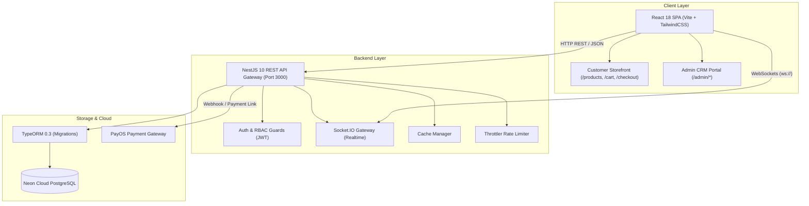

# 🛍️ KTD-STORE — Nền Tảng Thương Mại Điện Tử & Quản Trị MenWear Hub

<p align="center">
  
</p>

<p align="center">
  <strong>Giải pháp thương mại điện tử chuyên nghiệp dành cho thời trang nam cao cấp (Menswear Atelier).</strong><br>
  Tích hợp đầy đủ cổng bán lẻ trực tuyến (Storefront) và hệ thống quản trị quan hệ khách hàng & vận hành doanh nghiệp (Admin CRM / ERP thu nhỏ).
</p>

<p align="center">
  
  
  
  
  
</p>

---

## 📑 Mục Lục
- [1. Tổng Quan & Điểm Nổi Bật](#1-tổng-quan--điểm-nổi-bật)
- [2. Kiến Trúc Hệ Thống (Architecture)](#2-kiến-trúc-hệ-thống-architecture)
- [3. Cấu Trúc Thư Mục Dự Án](#3-cấu-trúc-thư-mục-dự-án)
- [4. Danh Sách Tính Năng Chi Tiết](#4-danh-sách-tính-năng-chi-tiết)
  - [4.1 Phân Hệ Khách Hàng (Customer Storefront)](#41-phân-hệ-khách-hàng-customer-storefront)
  - [4.2 Phân Hệ Quản Trị (Admin CRM & ERP)](#42-phân-hệ-quản-trị-admin-crm--erp)
  - [4.3 Phân Quyền Đa Tầng (RBAC) & Giả Lập Vai Trò](#43-phân-quyền-đa-tầng-rbac--giả-lập-vai-trò)
- [5. Thông Tin Tài Khoản Mặc Định](#5-thông-tin-tài-khoản-mặc-định)
- [6. Hướng Dẫn Khởi Chạy Nhanh (Quickstart)](#6-hướng-dẫn-khởi-chạy-nhanh-quickstart)
- [7. Cấu Hình Biến Môi Trường (.env)](#7-cấu-hình-biến-môi-trường-env)
- [8. Danh Mục REST API & Realtime Gateway](#8-danh-mục-rest-api--realtime-gateway)
- [9. Kiểm Thử & Đảm Bảo Chất Lượng (QA & Testing)](#9-kiểm-thử--đảm-bảo-chất-lượng-qa--testing)

---

## 1. 🌟 Tổng Quan & Điểm Nổi Bật

**KTD-Store** được thiết kế theo tiêu chuẩn công nghệ hiện đại, tập trung vào hiệu năng cao, trải nghiệm người dùng mượt mà và khả năng mở rộng mạnh mẽ:

* ⚡ **Hiệu năng tối ưu (Code-Splitting & Lazy Loading)**: Bundle client được chia nhỏ theo từng route. Thư viện đồ thị quản trị (`recharts`) chỉ tải khi người dùng truy cập trang Dashboard.
* ☁️ **Cơ sở dữ liệu đám mây Neon PostgreSQL**: Tích hợp sẵn chuỗi kết nối Serverless PostgreSQL trên Neon Tech, không cần cài đặt Postgres cục bộ hay Docker.
* 💳 **Cổng thanh toán PayOS & Sandbox QR Simulator**: Hỗ trợ quét mã VietQR tự động qua PayOS hoặc trải nghiệm thanh toán mô phỏng ngay trong môi trường Sandbox.
* 🤖 **Trợ lý thông minh AI Chatbot**: Tư vấn sản phẩm, gợi ý size theo chiều cao/cân nặng và giải đáp chính sách bán hàng 24/7.
* 🔔 **Thông báo thời gian thực (Realtime WebSockets)**: Cập nhật trạng thái đơn hàng, hoàn trả và thông báo biến động kho ngay lập tức.
* 🛡️ **Nhật ký Audit Logs & Phân quyền bảo mật cao**: Ghi nhận mọi tác vụ thay đổi giá, phân quyền, hoàn tiền và xóa danh mục nhằm đảm bảo tính minh bạch.

---

## 2. 🏛️ Kiến Trúc Hệ Thống (Architecture)



---

## 3. 📂 Cấu Trúc Thư Mục Dự Án

```
KTD-Store/
├── docs/                           # Tài liệu thiết kế, quy hoạch & hướng dẫn
│   ├── architecture/               # Kiến trúc hệ thống & UI/UX spec (architecture.md, design.md)
│   ├── planning/                   # Đặc tả yêu cầu & lộ trình (prd.md, spec.md, roadmap.md)
│   ├── guides/                     # Hướng dẫn setup, bàn giao & tối ưu (QUICKSTART.md, HANDOFF.md)
│   └── reports/                    # Báo cáo kiểm thử & Audit
│
├── backend/                        # NestJS API Server (Port 3000)
│   ├── src/
│   │   ├── common/                 # Guards, Decorators, Enums, Filters
│   │   ├── migrations/             # TypeORM Database Migrations
│   │   ├── modules/                # 22 Phân hệ chức năng chính (auth, products, orders...)
│   │   ├── app.module.ts           # Root Module liên kết toàn bộ phân hệ
│   │   ├── main.ts                 # Điểm khởi động NestJS API
│   │   └── typeorm.config.ts       # Cấu hình kết nối Neon PostgreSQL
│   ├── .env                        # Cấu hình môi trường Backend
│   └── package.json
│
├── frontend/                       # React Single Page Application (Port 5173)
│   ├── src/
│   │   ├── components/             # Reusable UI Components theo phân loại
│   │   │   ├── common/             # UI Primitives: Accordion, EmptyState, QtyStepper, PromoBadge, ScrollToTop
│   │   │   ├── layouts/            # Layout shells: AdminLayout, CustomerLayout, SiteHeader, SiteFooter...
│   │   │   ├── storefront/         # ProductCard, VariantSelector, FilterSidebar, SandboxPaymentModal...
│   │   │   ├── admin/              # OrderStatusBadge...
│   │   │   ├── widgets/            # AIChatWidget, FloatingContactWidget, NotificationBell...
│   │   │   ├── guards/             # PermissionGuard
│   │   │   └── index.ts            # Barrel export toàn bộ components
│   │   ├── pages/                  # Toàn bộ màn hình phân theo vai trò
│   │   │   ├── admin/              # 9 Trang quản trị (Dashboard, Catalog, Orders, Staff, Settings...)
│   │   │   ├── storefront/         # 11 Trang mua sắm (Home, Products, Detail, Cart, Checkout...)
│   │   │   └── index.ts            # Barrel export toàn bộ pages
│   │   ├── types/                  # Types phân tách theo Domain (product, order, cart, discount, return, user)
│   │   ├── context/                # React Context (Toast notification, Đa ngôn ngữ)
│   │   ├── hooks/                  # Custom React Query Hooks (useAuth, useCart, useOrders, ...)
│   │   ├── lib/                    # API Client (Axios), Socket Client, Query Client
│   │   ├── App.tsx                 # Routing & Code-Splitting (React.lazy)
│   │   └── main.tsx
│   ├── vite.config.ts              # Cấu hình Vite, Proxy API, Rollup Chunks
│   └── package.json
│
├── e2e/                            # Playwright End-to-End Test Suites
├── README.md                       # Tài liệu tổng quan dự án
└── package.json                    # Root script điều phối đồng thời Backend + Frontend
```

---

## 4. 🎯 Danh Sách Tính Năng Chi Tiết

### 4.1 Phân Hệ Khách Hàng (Customer Storefront)
* 👔 **Catalog & Bộ lọc chuyên sâu**: Lọc theo danh mục, thương hiệu, khoảng giá, màu sắc, size. Hỗ trợ sắp xếp theo giá và độ phổ biến.
* 🔍 **Tìm kiếm thông minh (Smart Search)**: Autocomplete gợi ý từ khóa, thương hiệu và sản phẩm phù hợp ngay khi gõ.
* 🎨 **Ma trận Biến thể (Variant Matrix)**: Chọn Size và Màu sắc trực quan, tự động cập nhật số lượng tồn kho còn lại và khóa nút mua nếu hết hàng.
* 📐 **Bảng tính Size chuẩn xác (Size Guide)**: Nhập chiều cao & cân nặng để hệ thống tự động gợi ý kích thước (S, M, L, XL, XXL) phù hợp nhất.
* 🛒 **Giỏ hàng thời gian thực (Optimistic Cart)**: Tự động kiểm tra tính hợp lệ của số lượng tồn kho, áp dụng mã khuyến mãi ngay trong giỏ.
* 💳 **Thanh toán linh hoạt (Checkout)**:
  * Thanh toán khi nhận hàng (**COD**).
  * Chuyển khoản ngân hàng qua mã **VietQR (PayOS)** với cửa sổ mô phỏng Sandbox tức thì.
* 📦 **Theo dõi đơn hàng (Order Tracking)**: Dòng thời gian chi tiết trực quan từ lúc tiếp nhận đến khi giao hàng thành công.
* 🔄 **Gửi yêu cầu đổi trả (Returns)**: Khách hàng dễ dàng tạo yêu cầu hoàn trả/đổi kích cỡ kèm lý do và ảnh minh họa.
* 💖 **Yêu thích & Sổ địa chỉ**: Lưu danh sách sản phẩm quan tâm và quản lý nhiều địa chỉ nhận hàng tiện lợi.
* 💬 **Trợ lý AI hỗ trợ**: Hộp chat AI sẵn sàng giải đáp về chính sách bảo hành, đổi trả và tư vấn phối đồ.

---

### 4.2 Phân Hệ Quản Trị (Admin CRM & ERP)
* 📊 **Dashboard & Báo Cáo Doanh Thu**:
  * Tổng doanh thu, tổng số đơn, đơn chờ xử lý, tỷ lệ hoàn trả.
  * Biểu đồ doanh thu theo ngày/tuần/tháng (Recharts).
  * Danh sách Top 5 sản phẩm bán chạy nhất.
* 📦 **Quản lý Đơn hàng & State Machine**:
  * Chuyển trạng thái nghiêm ngặt: `PENDING` ➔ `CONFIRMED` ➔ `SHIPPING` ➔ `COMPLETED` (hoặc `CANCELLED`).
  * Tự động hoàn lại tồn kho khi đơn hàng bị hủy.
* 🏷️ **Quản lý Danh mục, Thương hiệu & Sản phẩm**:
  * Thêm/sửa/xóa sản phẩm, ảnh đại diện, SKU, bảng biến thể (Size/Color/Stock).
  * Tự động cảnh báo các mặt hàng sắp hết kho (`Low Stock Warning`).
* 🎟️ **Quản lý Khuyến mãi (Discounts & Vouchers)**:
  * Tạo mã giảm theo `%` hoặc số tiền cố định.
  * Giới hạn ngân sách, số lượt sử dụng tối đa, phạm vi áp dụng (toàn sàn hoặc danh mục cụ thể).
* 🔄 **Xử lý Đổi trả & Hoàn tiền (Returns Management)**:
  * Duyệt/từ chối yêu cầu đổi trả (`APPROVED`, `REJECTED`, `REFUNDED`).
  * Tự động nhập kho lại đối với các sản phẩm được chấp thuận hoàn trả.
* 👥 **Quản lý Nhân sự & Phân quyền**:
  * Tạo tài khoản nhân viên, phân vai trò (`CEO`, `MANAGER`, `STAFF`).
  * Khóa/mở khóa tài khoản nhân viên.
* 🛡️ **Nhật ký Hệ thống (Audit Logs)**:
  * Lưu trữ chi tiết địa chỉ IP, User ID, loại hành động (`CREATE_PRODUCT`, `UPDATE_ROLE`, `APPROVE_RETURN`), thời gian thực hiện.

---

### 4.3 Phân Quyền Đa Tầng (RBAC) & Giả Lập Vai Trò

Hệ thống được thiết kế với 4 cấp độ quyền hạn rõ ràng:

| Vai Trò | Dashboard | Quản lý Đơn | Quản lý Kho/SP | Khuyến mãi | Đổi trả | Nhân sự | Audit Logs |
|:---|:---:|:---:|:---:|:---:|:---:|:---:|:---:|
| **SUPER_ADMIN** | ✅ | ✅ | ✅ | ✅ | ✅ | ✅ | ✅ |
| **CEO** | ✅ | ✅ | ✅ | ✅ | ✅ | ✅ | ❌ |
| **MANAGER** | ✅ | ✅ | ✅ | ✅ | ✅ | ❌ | ❌ |
| **STAFF** | ❌ | ✅ | ❌ | ❌ | ✅ | ❌ | ❌ |

> 💡 **Tính Năng Giả Lập Vai Trò (Role Simulation)**: Super Admin có thể trải nghiệm giao diện và quyền hạn của bất kỳ vị trí nào (`CEO`, `MANAGER`, `STAFF`) chỉ với 1 click tại Header để kiểm thử phân quyền trực quan.

---

## 5. 🔐 Thông Tin Tài Khoản & Truy Cập

> 🔒 **Bảo mật:** Thông tin tài khoản Quản trị viên cấp cao (Super Admin) và nhân sự được quản lý và cấp phát nội bộ. Vui lòng liên hệ Quản trị viên hệ thống để nhận thông tin đăng nhập hoặc khởi tạo tài khoản qua cấu hình môi trường phát triển.

| Vai Trò | Phạm Vi Quyền Hạn | Ghi Chú |
|---|---|---|
| **Super Admin** | Toàn quyền quản trị hệ thống | Quản trị viên cấp cao nhất |
| **CEO** | Xem Dashboard, quản lý toàn bộ nghiệp vụ | Không truy cập Audit Logs |
| **Manager** | Quản lý Đơn hàng, Catalog, Khuyến mãi, Đổi trả | Cấp quản lý vận hành |
| **Staff** | Xử lý Đơn hàng và Đổi trả hàng | Nhân viên vận hành |

---

## 6. 🚀 Hướng Dẫn Khởi Chạy Nhanh (Quickstart)

### Yêu cầu hệ thống:
* **Node.js**: Phiên bản `18.x` hoặc `20.x` trở lên
* **npm**: Phiên bản `9.x` trở lên
* **Internet**: Để kết nối tới Neon Cloud PostgreSQL

---

### ⚡ Cách 1: Khởi Chạy 1 Lệnh (Khuyên Dùng)

Tại thư mục gốc dự án (`KTD-Store`):
```bash
# 1. Cài đặt toàn bộ dependencies (chỉ cần chạy lần đầu)
npm install
npm --prefix backend install
npm --prefix frontend install

# 2. Khởi chạy đồng thời cả Backend (Port 3000) và Frontend (Port 5173)
npm run dev
```

Truy cập trên trình duyệt:
* 🛍️ **Cửa hàng Khách hàng**: [http://localhost:5173](http://localhost:5173)
* 🔐 **Đăng nhập Quản trị CRM**: [http://localhost:5173/admin/login](http://localhost:5173/admin/login) *(hoặc `/crm`)*
* 🔌 **Backend REST API**: [http://localhost:3000](http://localhost:3000)

---

### 🛠️ Cách 2: Khởi Chạy Từng Phân Hệ Riêng Biệt

#### Khởi động Backend API (Port 3000):
```bash
cd backend
npm run start:dev
```

#### Khởi động Frontend Client (Port 5173):
```bash
cd frontend
npm run dev
```

---

## 7. ⚙️ Cấu Hình Biến Môi Trường (.env)

Tệp mẫu cấu hình đặt tại `backend/.env` (tham khảo `backend/.env.example`):

```env
PORT=3000

# Kết nối Cơ sở dữ liệu Neon Cloud PostgreSQL
DB_HOST=ep-morning-queen-az2lfhe5.c-3.ap-southeast-1.aws.neon.tech
DB_PORT=5432
DB_USERNAME=neondb_owner
DB_PASSWORD=********
DB_NAME=neondb
DB_SSL=true

# Khóa bảo mật JWT
JWT_SECRET=your_super_secret_jwt_key
JWT_EXPIRATION=8h
JWT_REFRESH_SECRET=your_super_secret_refresh_jwt_key
JWT_REFRESH_EXPIRATION=7d

# Cổng thanh toán PayOS
PAYOS_CLIENT_ID=your_payos_client_id
PAYOS_API_KEY=your_payos_api_key
PAYOS_CHECKSUM_KEY=your_payos_checksum_key
```

---

## 8. 📡 Danh Mục REST API & Realtime Gateway

### 🔑 Authentication & Users
* `POST /auth/register` — Đăng ký tài khoản khách hàng
* `POST /auth/login` — Đăng nhập hệ thống (nhận Access & Refresh Token)
* `POST /auth/refresh` — Làm mới Access Token
* `GET /users` — Danh sách người dùng (Admin)
* `POST /users` — Tạo tài khoản nhân sự mới (Super Admin / CEO)
* `PATCH /users/:id` — Cập nhật thông tin / Phân quyền / Khóa tài khoản

### 🛍️ Products & Catalog
* `GET /products` — Lấy danh sách sản phẩm (hỗ trợ phân trang, lọc, search)
* `GET /products/:id` — Lấy chi tiết sản phẩm kèm ma trận Variants & Reviews
* `POST /products` — Tạo sản phẩm mới (Admin)
* `PATCH /products/:id` — Cập nhật sản phẩm / Kho biến thể
* `DELETE /products/:id` — Xóa sản phẩm

### 🛒 Cart & Checkout
* `GET /cart` — Lấy giỏ hàng của người dùng hiện tại
* `POST /cart/items` — Thêm sản phẩm & biến thể vào giỏ
* `PATCH /cart/items/:id` — Cập nhật số lượng
* `DELETE /cart/items/:id` — Xóa món đồ khỏi giỏ

### 📦 Orders & Payments
* `POST /orders` — Đặt hàng mới (COD / VietQR)
* `GET /orders/my-orders` — Lịch sử đơn hàng của khách
* `GET /orders` — Danh sách đơn hàng toàn hệ thống (Admin)
* `PATCH /orders/:id/status` — Cập nhật trạng thái đơn hàng (Admin State Machine)
* `POST /payments/create-payment-link` — Tạo liên kết thanh toán PayOS
* `POST /payments/webhook` — Webhook tiếp nhận kết quả thanh toán từ PayOS

### 🎟️ Discounts & Returns & AI
* `POST /discounts/validate` — Kiểm tra và tính số tiền giảm của mã voucher
* `POST /returns` — Khách hàng tạo yêu cầu đổi trả
* `PATCH /returns/:id/status` — Duyệt / Từ chối yêu cầu đổi trả (Admin)
* `POST /ai-assistant/chat` — Gửi câu hỏi cho Trợ lý AI tư vấn

### 🔔 WebSockets (Socket.IO)
* **Namespace**: `/` (Port 3000)
* **Event Lắng nghe**: `notification`, `order_status_updated`, `inventory_alert`

---

## 9. 🧪 Kiểm Thử & Đảm Bảo Chất Lượng (QA & Testing)

Dự án trang bị hệ thống kiểm thử toàn diện từ Unit Test đến End-to-End:

### 1. Chạy Unit Tests Backend (NestJS + Jest):
```bash
npm --prefix backend test
```
> ✅ **Kết quả**: 16/16 Test Suites passed, 76/76 Unit Tests passed (Bao gồm Auth, Orders, Products, Returns, Discounts, Loyalty, Permissions Guard,...).

### 2. Chạy Unit Tests Frontend (React + Vitest):
```bash
npm --prefix frontend test -- --run
```
> ✅ **Kết quả**: 7/7 Test Suites passed, 16/16 UI Flow Tests passed (Bao gồm Cart Page, Admin Orders State Machine, Variant Selector, Permission Guard,...).

### 3. Kiểm tra Production Build:
```bash
npm run build
```
> ✅ **Kết quả**: Cả Backend NestJS và Frontend Vite build thành công sạch sẽ, tối ưu gzip và dung lượng file tĩnh.

---

## 📄 Bản Quyền & Giấy Phép

Dự án được xây dựng và phát triển bởi đội ngũ **KTD-Store (MenWear Hub)**. Mọi quyền được bảo lưu © 2026.
